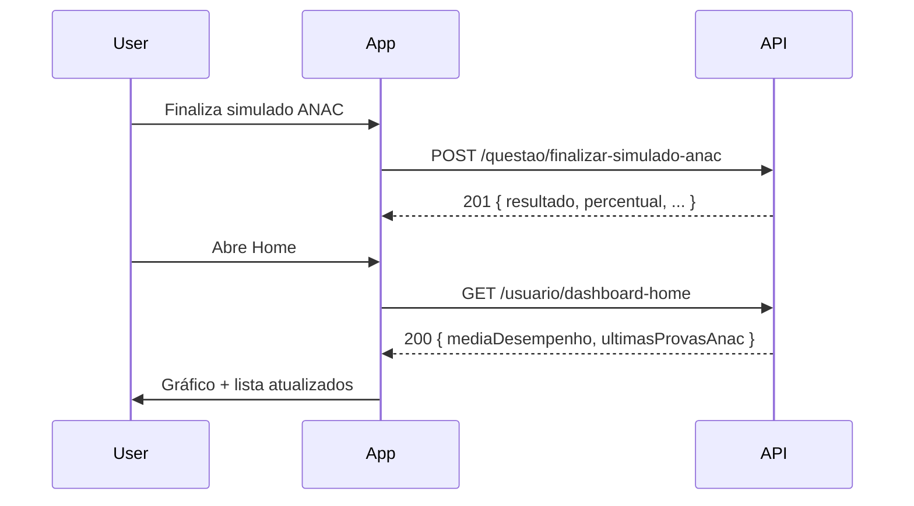

# API — Dashboard Home e Simulado ANAC (App Mobile)

Contrato entre **backend** e **app Sala AIS** para o dashboard da Home e persistência de simulados ANAC finalizados.

---

## Configuração geral

| Item | Valor |
|------|--------|
| Base URL | `https://api.salaais.com.br` (ou `EXPO_PUBLIC_API_URL`) |
| Autenticação | `Authorization: Bearer {accessToken}` |
| Header | `Content-Type: application/json` |

---

## 1. Dashboard Home

Retorna dados do gráfico de desempenho e das últimas provas ANAC (até **10**).

| Item | Valor |
|------|--------|
| Método | `GET` |
| URL | `{API_URL}/usuario/dashboard-home` |
| Sucesso | `200` |

### Sem histórico

Retornar `200` com média e distribuição em **zero** e lista vazia:

```json
{
  "mediaDesempenho": {
    "mediaPercentual": 0,
    "distribuicao": {
      "aprovado": 0,
      "reprovado": 0,
      "segundaEpoca": 0
    }
  },
  "ultimasProvasAnac": []
}
```

### Resposta com dados (`HomeDashboardPayload`)

```json
{
  "mediaDesempenho": {
    "mediaPercentual": 74,
    "distribuicao": {
      "aprovado": 48,
      "reprovado": 22,
      "segundaEpoca": 30
    }
  },
  "ultimasProvasAnac": [
    {
      "id": "550e8400-e29b-41d4-a716-446655440000",
      "realizadaEm": "2026-05-15T14:30:00.000Z",
      "duracaoMinutos": 95,
      "resultado": "APROVADO",
      "percentual": 82
    }
  ]
}
```

### Campos — `mediaDesempenho`

| Campo | Tipo | Descrição |
|-------|------|-----------|
| `mediaPercentual` | `number` | Média geral (**0–100**). Centro do gráfico. |
| `distribuicao.aprovado` | `number` | Fatia **Aprovado** (azul ANAC `#005C92`) |
| `distribuicao.reprovado` | `number` | Fatia **Reprovado** |
| `distribuicao.segundaEpoca` | `number` | Fatia **2ª Época** |

O app **normaliza** os três valores da distribuição (percentuais ou contagens).

### Campos — `ultimasProvasAnac[]`

| Campo | Tipo | Descrição |
|-------|------|-----------|
| `id` | `string` | UUID da prova |
| `realizadaEm` | `string` | ISO 8601 UTC (`Z`) |
| `duracaoMinutos` | `number` | Duração em minutos |
| `resultado` | `enum` | `APROVADO` \| `REPROVADO` \| `2ª ÉPOCA` |
| `percentual` | `number` | Nota **0–100** |

Ordenação: **mais recente primeiro**. Limite sugerido: **10** itens.

### cURL

```bash
curl -X GET "https://api.salaais.com.br/usuario/dashboard-home" \
  -H "Content-Type: application/json" \
  -H "Authorization: Bearer SEU_ACCESS_TOKEN"
```

---

## 2. Finalizar simulado ANAC

Persiste a prova no servidor. **Somente** simulados ANAC finalizados por este endpoint entram no histórico do dashboard.

> `POST /questao/correcao_simples` permanece inalterado e **não** salva histórico.

| Item | Valor |
|------|--------|
| Método | `POST` |
| URL | `{API_URL}/questao/finalizar-simulado-anac` |
| Sucesso | `201` |

### Body (`FinalizarSimuladoAnacPayload`)

```json
{
  "respostas": [
    { "key": "cms-22", "alternativa": "c" }
  ],
  "duracaoMinutos": 95,
  "realizadaEm": "2026-05-15T14:30:00.000Z"
}
```

| Campo | Tipo | Obrigatório | Descrição |
|-------|------|:-----------:|-----------|
| `respostas` | `array` | Sim | Respostas do simulado |
| `respostas[].key` | `string` | Sim | Chave da questão (ex.: `cms-22`) |
| `respostas[].alternativa` | `string` | Sim | `a`, `b`, `c` ou `d` |
| `duracaoMinutos` | `number` | Sim | Tempo gasto na prova (minutos) |
| `realizadaEm` | `string` | Não | ISO 8601 UTC; se omitido, o servidor pode usar a data atual |

### Resposta (`201`)

```json
{
  "id": "550e8400-e29b-41d4-a716-446655440000",
  "resultado": "APROVADO",
  "percentual": 82,
  "realizadaEm": "2026-05-15T14:30:00.000Z"
}
```

| Campo | Tipo | Descrição |
|-------|------|-----------|
| `id` | `string` | UUID da prova salva |
| `resultado` | `enum` | `APROVADO` \| `REPROVADO` \| `2ª ÉPOCA` |
| `percentual` | `number` | Nota calculada pelo servidor (**0–100**) |
| `realizadaEm` | `string` | Data/hora persistida (ISO 8601) |

### Regra de `resultado` (backend)

| Condição | `resultado` |
|----------|-------------|
| Nenhum bloco com nota &lt; 70% | `APROVADO` |
| Exatamente 1 bloco &lt; 70% **e** 1 bloco entre 30% e 69% | `2ª ÉPOCA` |
| Demais casos | `REPROVADO` |

### cURL

```bash
curl -X POST "https://api.salaais.com.br/questao/finalizar-simulado-anac" \
  -H "Content-Type: application/json" \
  -H "Authorization: Bearer SEU_ACCESS_TOKEN" \
  -d '{
    "respostas": [{ "key": "cms-22", "alternativa": "c" }],
    "duracaoMinutos": 95,
    "realizadaEm": "2026-05-15T14:30:00.000Z"
  }'
```

---

## Fluxo no app



---

## Referência no repositório mobile

| Arquivo | Conteúdo |
|---------|----------|
| `src/types/homeDashboard.ts` | `HomeDashboardPayload`, `EMPTY_HOME_DASHBOARD` |
| `src/services/type.ts` | `FinalizarSimuladoAnacPayload`, `FinalizarSimuladoAnacResponse` |
| `src/services/services.ts` | `getDashboardHome`, `finalizarSimuladoAnac` |
| `src/mocks/homeDashboard.mock.ts` | Mock para desenvolvimento offline |
| `src/screens/Home/index.tsx` | Consome `GET /usuario/dashboard-home` |
| `src/screens/Quiz/Anac/index.tsx` | Chama `POST /questao/finalizar-simulado-anac` ao finalizar |

### Tipos TypeScript

```typescript
// GET /usuario/dashboard-home
type HomeDashboardPayload = {
  mediaDesempenho: {
    mediaPercentual: number;
    distribuicao: {
      aprovado: number;
      reprovado: number;
      segundaEpoca: number;
    };
  };
  ultimasProvasAnac: {
    id: string;
    realizadaEm: string;
    duracaoMinutos: number;
    resultado: "APROVADO" | "REPROVADO" | "2ª ÉPOCA";
    percentual: number;
  }[];
};

// POST /questao/finalizar-simulado-anac
type FinalizarSimuladoAnacPayload = {
  respostas: { key: string; alternativa: string }[];
  duracaoMinutos: number;
  realizadaEm?: string;
};

type FinalizarSimuladoAnacResponse = {
  id: string;
  resultado: "APROVADO" | "REPROVADO" | "2ª ÉPOCA";
  percentual: number;
  realizadaEm: string;
};
```

---

## Changelog

| Data | Versão | Descrição |
|------|--------|-----------|
| 2026-05-18 | 1.0.0 | Documento inicial |
| 2026-06-01 | 1.1.0 | Endpoints confirmados pelo backend; POST finalizar simulado ANAC |
